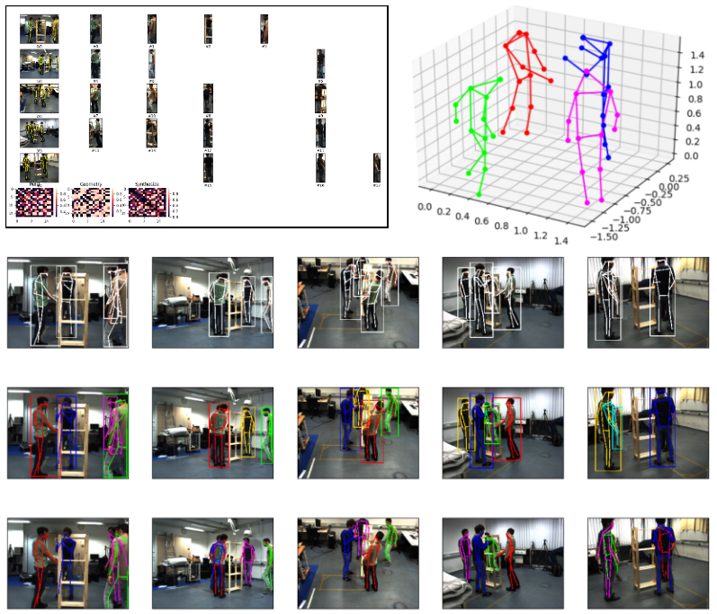

# Fast and Robust Multi-Person 3D Pose Estimation from Multiple Views


> [Fast and Robust Multi-Person 3D Pose Estimation from Multiple Views](https://arxiv.org/pdf/1901.04111.pdf)  
> Junting Dong, Wen Jiang, Qixing Huang, Hujun Bao, Xiaowei Zhou   
> CVPR 2019, T-PAMI 2021 
> [Project Page](https://zju3dv.github.io/mvpose/)

Any questions or discussions are welcomed!


## Installation

 - Set up python environment

```   
pip install -r requirements.txt
```    

 - Compile the `backend/tf_cpn/lib` and `backend/light_head_rcnn/lib`
```
cd mvpose/backend/tf_cpn/lib/
make
cd ./lib_kernel/lib_nms
bash compile.sh
```
```
cd mvpose/backend/light_head_rcnn/lib/
bash make.sh
```

 Since they use py-faster-rcnn as backbone. Many people using faster-rcnn meet with some problems when compiling those components. Suggestions on google can be helpful.

 - Compile the pictorial function for acceleration
```
cd mvpose/src/m_lib/
python setup.py build_ext --inplace
```

## Prepare models and datasets

 -  **Prepare models**: 
Please put [light-head-rcnn models](https://drive.google.com/file/d/1klpM_DEIn2Ln4ZN-xWHdvwp40dYpQ05b/view?usp=sharing) to `backend/light_head_rcnn/output/model_dump`, 
    [backend/tf_cpn/log/model_dump](https://drive.google.com/file/d/1DJF4p-SC_PokGtt7TbCVPgo-EWRQYhGi/view?usp=sharing) to `backend/tf_cpn/log/model_dump`,
    and [CamStyle model](https://drive.google.com/file/d/1FRAu6sr0Bd39ZliCscum69mwuZ1j502b/view?usp=sharing) trained by myself to `backend/CamStyle/logs`

 - **Prepare the datasets**: 
Put datasets such as Shelf and CampusSeq1 to `./datasets/`
Download [Campus](http://campar.cs.tum.edu/files/belagian/multihuman/CampusSeq1.tar.bz2) and [Shelf](http://campar.cs.tum.edu/files/belagian/multihuman/Shelf.tar.bz2) datasets. Then, put datasets such as Shelf and CampusSeq1 to datasets/

 - **Generate the camera parameters**: 
   Since each dataset uses different way to obtain the camera parameters, we show an example to deal with the Campus dataset: 
   - Add following code to `.datasets/CampusSeq1/Calibration/producePmat.m`
   ```
   K = cell(1,3);
   K{1} = K1; K{2} = K2; K{3} = K3;
   m_RT = cell(1,3);
   m_RT{1} = RT1; m_RT{2} = RT2; m_RT{3} = RT3;
   save('intrinsic.mat','K');
   save('m_RT.mat', 'm_RT');
   save('P.mat', 'P');
   save('prjectionMat','P');
   ```
   - generate the `camera_parameter.pickle`
   ```
   python ./src/tools/mat2pickle.py /parameter/dir ./datasets/CampusSeq1
   ```
   Here, we also provide the camera_parameter.pickle of [Campus](https://drive.google.com/file/d/1BvIyB53Jb_asZ2gEoIRh8gYUvHxPDcPA/view?usp=sharing) and [Shelf](https://drive.google.com/file/d/1mWe9CpyYrsU7t2FFf5PMJw5CqFE-3Otj/view?usp=sharing). You can generate the .pickle file for your datasets using the same way.
## Demo and Evaluate

### Run the demo

```
python ./src/m_utils/demo.py -d Campus
python ./src/m_utils/demo.py -d Shelf
```

If all the configuration is OK, you may see the visualization of following items.




### Evaluate on the Campus/Shelf datasets

```
python ./src/m_utils/evaluate.py -d Campus
python ./src/m_utils/evaluate.py -d Shelf
```
As long as the progress bar finished, you may see a beautified table of evaluation result and a csv file for the evaluation result will be save in `./result` directory.

### Accelerate the evaluation

Since the 2D pose estimator (CPN) is a little slow, we can save the predicted 2D poses and heatmaps and then start with these saved files.

 1. produce the files
```
python src/tools/preprocess.py -d Campus -dump_dir ./datasets/Campus_processed
python src/tools/preprocess.py -d Shelf -dump_dir ./datasets/Shelf_processed
```
 2. evaluate with saved 2D poses and heatmaps
```
python ./src/m_utils/evaluate.py -d Campus -dumped ./datasets/Campus_processed
python ./src/m_utils/evaluate.py -d Shelf -dumped ./datasets/Shelf_processed
```
Note: for the sake of convenience, we do not optimize on the size of dumped file.
Therefore, the size of `Campus_processed` is around `4.0G` and the size of `Shelf_processed` is around `234G`. Please make sure your disk have `200+G` free space. Any pull request to solve this issues will be welcomed.

## Citation

If you find this code useful for your research, please use the following BibTeX entry.

```
@inproceedings{dong2019fast,
  title={Fast and Robust Multi-Person 3D Pose Estimation from Multiple Views},
  author={Dong, Junting and Jiang, Wen and Huang, Qixing and Bao, Hujun and Zhou, Xiaowei},
  journal={CVPR},
  year={2019}
}

@article{dong2021fastpami,
  title={Fast and Robust Multi-Person 3D Pose Estimation and Tracking from Multiple Views},
  author={Dong, Junting and Fang, Qi and Jiang, Wen and Yang, Yurou and Bao, Hujun and Zhou, Xiaowei},
  booktitle={T-PAMI},
  year={2021}
}
```
## Acknowledgements
This code uses these code ([Light head rcnn](https://github.com/zengarden/light_head_rcnn), [Cascaded Pyramid Network](https://github.com/chenyilun95/tf-cpn), [CamStyle](https://github.com/zhunzhong07/CamStyle)) as backbone. We gratefully appreciate the impact it had on our work. If you use our code, please consider citing the original paper as well.

## Copyright

This work is affliated with ZJU-SenseTime Joint Lab of 3D Vision, and its intellectual property belongs to SenseTime Group Ltd.

```
Copyright SenseTime. All Rights Reserved.

Licensed under the Apache License, Version 2.0 (the "License");
you may not use this file except in compliance with the License.
You may obtain a copy of the License at

    http://www.apache.org/licenses/LICENSE-2.0

Unless required by applicable law or agreed to in writing, software
distributed under the License is distributed on an "AS IS" BASIS,
WITHOUT WARRANTIES OR CONDITIONS OF ANY KIND, either express or implied.
See the License for the specific language governing permissions and
limitations under the License.
```
